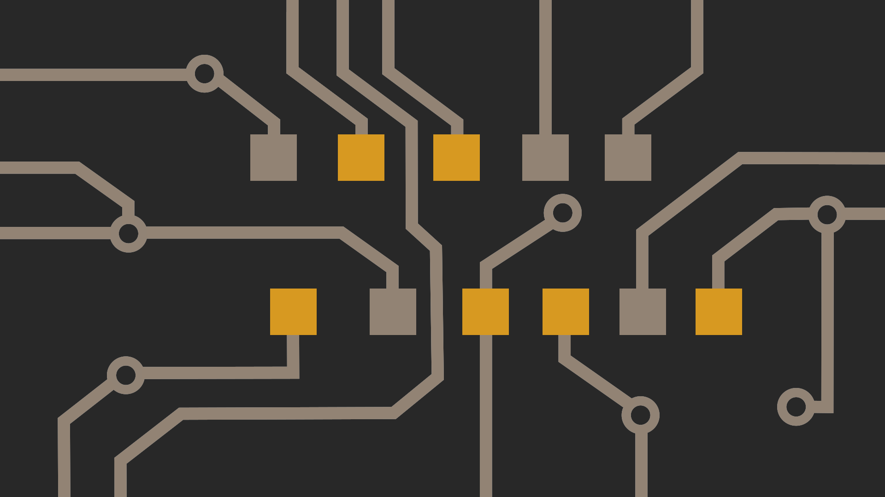

## Binary Clock Wallpaper

A python script to generate wallpaper that shows time in binary. 

Example picture when the time is 7:39 PM: 


### How to read it?
As you can see from the annotated picture below, the clock shows `0111 100111 1` in binary. If you convert it to decimal you will get
`4+2+1 32+4+2+1 1` which means `7:39 PM`. 


### Setting up the environment
First create a virtual environment for python and activate it:
```
python3 -m venv venv
source venv/bin/activate
```
Then install dependencies with:
```
pip3 install -r requirements.txt
```

### Usage
Run the following command and a file named `result.png` will be created under `img` directory. You can use that file to set your wallpaper.
```
python3 binary_clock_wallpaper.py
```

#### Change colors
You can change any color to match it with your environment. A color can be either hex value or a generic color name. 

```
python3 binary_clock_wallpaper.py --accent-color "#35d8dd"
python3 binary_clock_wallpaper.py --accent-color steelblue --wire-color gray --bg-color "#0f0f17"
```

#### Use 12 hour format
Default is 24-hour time. Change it like this if you want to use 12-hour time:
```
python3 binary_clock_wallpaper.py --use-12-hour
```

### Running it as a cronjob
You can run the helper script, `set_binary_wallpaper.sh`, as a cronjob to update your wallpaper every minute. The helper script uses `nitrogen` as wallpaper setter. Do not forget to change it if you use another program.

```
# Run "crontab -e" and add the following line to that file.

* * * * * /path/to/set_binary_wallpaper.sh
```
**Tip**: All the arguments passed to this script will be passed to python. So you can do the following to see the changes immediately while tweaking the colors:
```
./set_binary_wallpaper.sh --accent-color greenyellow --wire-color gray
```

#### Some more examples
Gruvbox             |  Dracula |        Nord
:-------------------------:|:-------------------------:|:-------:
  |   |  

#### Different resolution or design?
You can find the actual design files in `svg` directory. If you are not happy about the current design or resolution you can modify those files using Inkscape (or a similar program) and create your own design.

### Credits
- [Jake@Linux](https://www.youtube.com/channel/UC1yGcBvdPGxRIMT1yo_bKIQ) for giving me an inspiration to write this script with [one of his videos](https://www.youtube.com/watch?v=RJmiWfSVW8Q).
- [@loicreynier](https://github.com/loicreynier) for adding accent color support.

